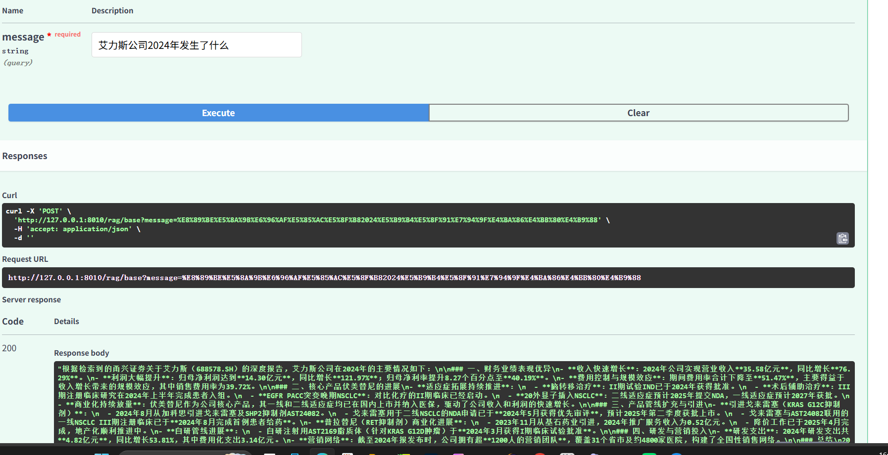

# 🧠 Multimodal Agentic RAG QA System

## 📌 Overview
This project is an AI-powered document understanding system designed to solve the limitations of LLMs in handling long and complex documents.

It supports multimodal inputs (PDF, DOCX, PPT, Images) and enables intelligent question answering and automatic report generation using a RAG + Agent-based architecture.

---

## 🚀 Key Features
- Multi-format document ingestion (PDF, DOCX, PPT, Images)
- OCR-based text extraction for scanned files
- Semantic retrieval using vector database (Qdrant)
- RAG-based question answering
- Automated structured report generation
- Agentic workflow for tool orchestration

---

## 🧩 Architecture
User Upload  
→ Document Parsing  
→ Text Chunking & Embedding  
→ Vector Database (Qdrant)  
→ Semantic Retrieval  
→ LLM Generation  
→ Answer / Report Output  

---

## 📈 Performance
- QA accuracy improved by ~25%–35% compared to direct LLM answering
- Better context recall in long-document scenarios

---

## 🛠 Tech Stack
- FastAPI
- Python
- Qdrant
- OCR / Vision Models
- LLM APIs
- Prompt Engineering

---

## 📷 Demo

---

## 👤 Author
AI Product-Oriented Builder
